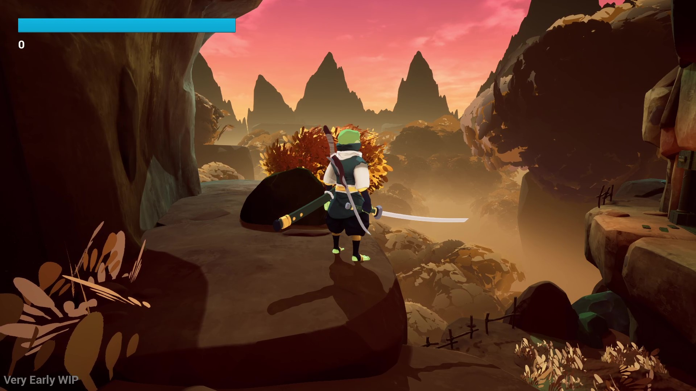

# FrogGame Showcase

## Project Overview
This repository showcases a polished 3D UE4 action game developed over six months by a three-person team.
I served as the project head and lead programmer, handling gameplay code, save systems, sound and animation, and the behavior of anything within the game itself; my team-members handled the ideating and creation process of the 3D models.
Development was suspended after the team graduated and moved on to new commitments, but some final strides were made to bring the project to a satisfactory stopping point.

## My Role
My responsibilities included:
- Project leadership and team coordination
- Gameplay programming
- Save system programming
- Player movement and combat implementation
- Enemy movement and combat implementation
- Sound desgin and implementation
- Animation design and implementation
- Gameplay "wrappers" (menus and such)

Other team contributors:
3D modeling and texturing: Juuso Hirvonen

Concept art: Mikael Rantanen

## Project Highlights
- Spearheaded a three-person team for six months of independent development
- Built out core game systems in Unreal Engine (save systems, menus, etc.)
- Implemented player movement, combat, animations, and sounds
- Integrated concept-driven 3D models and textures
- Established a polished, cel-shaded visual style driven by focused design documents
- Reached a playable vertical-slice before development was suspended

## Media

### Gameplay Preview

### Screenshots

## Technical Focus
This showcase emphasizes the systems that I personally worked on:
- Player movement
- Combat logic
- Gameplay-state driven animation
- Enemy behvaior
- Sound and feedback
- Team workflow and communications

## Code Samples
The full source code for this project will remain private since the team may one day return to development. However, I have selected isolated code samples for the purpose of this repository to demonstrate my programming style and system design.

| Sample | Focus |
|---|---|
| [Wall Interaction Detection](code-samples/player-movement/wall-interaction-detection/) | Trace-based movement actions, ledge detection, wall climbs, wall scrapes, and wall runs |
| [Input Buffering](code-samples/player-controller/input-buffering/) | Game-feel-oriented input buffering for movement and combat actions |
| [Boss Melee Selection](code-samples/enemy-ai/boss-melee-selection/) | Spatial enemy attack selection based on player position |
| [Minion Spawn Selection](code-samples/enemy-ai/minion-spawn-selection/) | Valid ground detection and safe enemy spawning |
| [Attack Variety Selection](code-samples/enemy-ai/attack-variety-selection/) | Enemy attack selection with anti-repetition logic |

## Documentation

## Source Availability
The complete source code and raw asset files are not present in this repository, since development may one day continue in the future.

This public repository is iuntended as a portfolio showcase containing media, documentation, and selected source excerpts from my work on the project.
